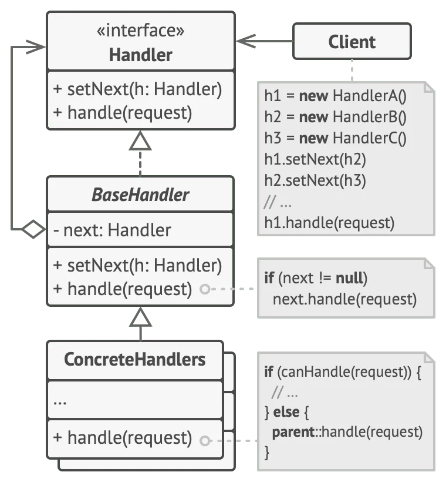

# What are Design Patterns?

Design patterns offer standard solutions for common problems encountered in software design. These patterns resemble pre-made blueprints that you can tailor to address recurring design challenges within your codebase.

Unlike plug-and-play functions or libraries, design patterns cannot be directly copied into your program. Rather, they represent general concepts for solving specific issues. By grasping the intricacies of a pattern, you can create a tailored solution that aligns with the unique requirements of your application.

## Design Patterns Vs. Algorithms
Design patterns are sometimes mistaken for algorithms due to their shared trait of offering solutions to familiar problems. The central distinction lies in scope and abstraction.

Design patterns address architecture and design complexities, while algorithms navigate computational steps. Design patterns present reusable strategies for system structure, while algorithms outline a precise sequence of actions to achieve a particular objective. The implementation of the same pattern across two distinct programs can indeed differ.

# Benefits of Using Design Patterns
Using design patterns offers numerous advantages to software development:

Reusability: Design patterns provide solutions that have already been refined and tested, enabling developers to reuse successful strategies for various projects.

Maintainability: Applying design patterns promotes modular and organized code, making it easier to update and maintain in the long run.

Scalability: Design patterns allow software systems to evolve gracefully, accommodating changes without causing widespread disruptions.

Consistency: Using design patterns establishes a common vocabulary and approach for developers, fostering clear communication and collaboration.

Efficiency: Design patterns address common challenges efficiently, reducing development time and the potential for errors.

# Categories of Design Patterns

Creational Patterns: Facilitate flexible object creation and code reuse.
Structural Patterns: Assembling objects and classes into larger structures while retaining their adaptability and efficiency
Behavioral Patterns: Efficient interaction and allocation of responsibilities between objects, ensuring effective communication.

## Creational Patterns
Singleton Pattern: Ensures that a class has only one instance and provides a global point of access to that instance.
Factory Method Pattern: Defines an interface for creating objects, allowing subclasses to decide which class to instantiate.
Abstract Factory Pattern: Provides an interface for creating families of related or dependent objects without specifying their concrete classes.
Builder Pattern: Separates the construction of a complex object from its representation, allowing the same construction process to create different representations.
Prototype Pattern: Creates new objects by copying an existing object, avoiding the overhead of creating objects from scratch.

## Structural Patterns

Adapter Pattern: Converts the interface of a class into another interface that clients expect, enabling classes with incompatible interfaces to work together.
Bridge Pattern: Decouples an abstraction from its implementation, allowing both to evolve independently.
Composite Pattern: Composes objects into tree structures to represent part-whole hierarchies, making it easier to work with individual objects and compositions.
Decorator Pattern: Dynamically adds responsibilities to objects, providing a flexible alternative to subclassing for extending functionality.
Facade Pattern: Provides a simplified interface to a complex subsystem, making it easier to use and understand.
Flyweight Pattern: Shares instances of objects to support large numbers of fine-grained objects efficiently.
Proxy Pattern: provide a substitute or placeholder for another object to control access to the original object.

## Behavioral Patterns

Chain of Responsibility Pattern: Creates a chain of objects that can handle requests, avoiding coupling the sender with its receivers.
Command Pattern: Turns a request into a stand-alone object, allowing parameterization of clients with different requests.
Interpreter Pattern: Defines a grammar for a language and an interpreter to interpret sentences in the language.
Iterator Pattern: Provides a way to access elements of a collection without exposing its underlying representation.
Mediator Pattern: Defines an object that centralizes communication between multiple objects, reducing direct dependencies between them.
Memento Pattern: Captures and restores an object’s internal state, allowing it to be restored to a previous state.
Observer Pattern: Defines a dependency between objects, ensuring that when one object changes state, all its dependents are notified and updated automatically.
State Pattern: Allows an object to change its behavior when its internal state changes, enabling cleaner, more maintainable conditional logic.
Strategy Pattern: Defines a family of algorithms, encapsulates each one and makes them interchangeable. Clients can choose an algorithm from this family without modifying their code.
Template Method Pattern: Defines the structure of an algorithm in a superclass but lets subclasses override specific steps of the algorithm.
Visitor Pattern: Separates an algorithm from an object structure, allowing new operations to be added without modifying the objects themselves.

# What is the Chain of Responsibility Design Pattern?

The Chain of Responsibility Design Pattern is a behavioral pattern that provides a solution for passing requests along a chain of handlers.

These handlers, like links in a chain, process the request or pass it to the next handler in line. This pattern acts as an intermediary, allowing you to decouple the sender of a request from its receivers.

# When to Use the Chain of Responsibility Pattern
The Chain of Responsibility pattern is applicable in various scenarios where you need to streamline request processing:

Request Processing: In situations where requests must pass through multiple processing stages, each handling a specific task. If one stage fails, the request is forwarded to the next, ensuring efficient processing.
Logging: Logging systems with multiple log handlers like console, file, and email loggers. Handlers decide whether to handle a log message based on severity. If a handler can’t, it gracefully passes it to the next in the chain.
User Interface Events: For user interface components, such as buttons, that handle events through a chain of listeners. Each listener can decide whether to consume or propagate the event, offering flexibility in complex interfaces.

# Chain of Responsibility Anatomy
The Chain of Responsibility pattern is composed of key components and structured classes that work harmoniously to efficiently manage the flow of requests.

## Key Components
Handler (Abstract Class or Interface): The Handler is an abstract class or interface defining the common interface for concrete handlers. It typically includes the handle_request method, specifying how requests are processed. Concrete handlers must extend or implement this.
Concrete Handlers: Concrete Handlers are classes extending the Handler. They represent processing stages in the chain, responsible for handling specific requests. Each concrete handler processes a request or passes it to the next.

## Structure Classes
Client: The Client initiates requests and sends them to the first handler in the chain. It remains unaware of specific handlers and their responsibilities. The client creates and configures the chain.
Chain: The Chain class manages the sequence of handlers, maintaining them in an ordered list or other data structures. Its role is to pass requests from one handler to the next until successful processing or reaching the end of the chain.

